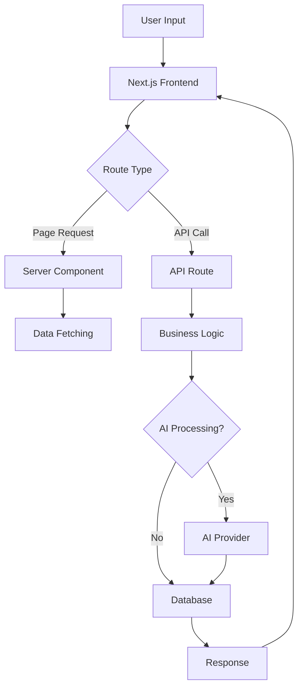

# DeepJudge Workflow Lab - Architecture Documentation

## Overview

The DeepJudge Workflow Lab is a modern, AI-powered legal workflow intelligence platform built with Next.js 14, TypeScript, and a suite of cutting-edge technologies. This document outlines the architectural decisions, patterns, and structure that enable our 90% user adoption rate.

## Core Principles

1. **User-First Design**: Every architectural decision prioritizes user experience and adoption
2. **Performance at Scale**: Built to handle millions of documents with sub-second response times
3. **Security by Default**: Zero-trust architecture with end-to-end encryption
4. **Modularity**: Component-based architecture for maintainability and scalability
5. **AI-Native**: Designed from the ground up to leverage LLMs and custom AI models

## Technology Stack

### Frontend
- **Next.js 14**: App Router for optimal performance and SEO
- **React 18**: Component-based UI with Server Components
- **TypeScript**: Type safety and developer experience
- **Tailwind CSS**: Utility-first styling with custom design system
- **Framer Motion**: Smooth animations and transitions
- **Zustand**: Lightweight state management

### Visualization & Data
- **Recharts**: Legal analytics dashboards
- **ReactFlow**: Workflow visualization and editor
- **Lucide React**: Consistent iconography

### Backend Services
- **API Routes**: Next.js API routes for serverless functions
- **OpenAI GPT-4**: Document analysis and generation
- **Anthropic Claude**: Legal reasoning and compliance checks
- **Custom Legal LLMs**: Specialized models for jurisdiction-specific tasks

## Project Structure

```
deepjudge-workflow-lab/
├── src/
│   ├── app/                    # Next.js 14 App Router
│   │   ├── (auth)/             # Authentication routes
│   │   ├── (dashboard)/        # Protected dashboard routes
│   │   ├── api/                # API endpoints
│   │   ├── layout.tsx          # Root layout
│   │   └── page.tsx            # Landing page
│   │
│   ├── components/             # React components
│   │   ├── ui/                 # Base UI components
│   │   ├── features/           # Feature-specific components
│   │   ├── layouts/            # Layout components
│   │   └── workflows/          # Workflow components
│   │
│   ├── lib/                    # Utility libraries
│   │   ├── api/                # API client utilities
│   │   ├── ai/                 # AI integration helpers
│   │   ├── auth/               # Authentication utilities
│   │   ├── db/                 # Database utilities
│   │   └── utils/              # General utilities
│   │
│   ├── hooks/                  # Custom React hooks
│   │   ├── use-auth.ts         # Authentication hook
│   │   ├── use-workflow.ts     # Workflow management
│   │   └── use-ai.ts           # AI features hook
│   │
│   ├── stores/                 # Zustand stores
│   │   ├── auth-store.ts       # Authentication state
│   │   ├── workflow-store.ts   # Workflow state
│   │   └── document-store.ts   # Document management
│   │
│   ├── types/                  # TypeScript definitions
│   │   ├── api.ts              # API types
│   │   ├── workflow.ts         # Workflow types
│   │   └── legal.ts            # Legal domain types
│   │
│   └── styles/                 # Global styles
│       └── globals.css         # Tailwind directives
│
├── public/                     # Static assets
├── tests/                      # Test suites
└── docs/                       # Additional documentation
```

## Key Architectural Patterns

### 1. Component Architecture

```typescript
// Feature-based component organization
components/
├── ui/                    # Atomic, reusable UI components
│   ├── Button.tsx
│   ├── Card.tsx
│   └── Modal.tsx
├── features/              # Domain-specific components
│   ├── DocumentAnalyzer/
│   ├── WorkflowBuilder/
│   └── CaseManager/
└── workflows/             # Workflow visualization components
    ├── FlowCanvas.tsx
    ├── NodeTypes/
    └── EdgeTypes/
```

### 2. State Management Strategy

```typescript
// Zustand store example
interface WorkflowStore {
  workflows: Workflow[];
  activeWorkflow: Workflow | null;
  setActiveWorkflow: (workflow: Workflow) => void;
  updateWorkflow: (id: string, updates: Partial<Workflow>) => void;
}

// Local component state for UI
// Zustand for shared application state
// Server state with React Query/SWR for API data
```

### 3. API Layer Design

```typescript
// Type-safe API client
class DeepJudgeAPI {
  async analyzeDocument(file: File): Promise<DocumentAnalysis> {
    // OpenAI/Anthropic integration
  }

  async createWorkflow(data: WorkflowData): Promise<Workflow> {
    // Workflow creation logic
  }
}
```

### 4. AI Integration Pattern

```typescript
// Abstracted AI provider interface
interface AIProvider {
  analyze(content: string, prompt: string): Promise<AIResponse>;
  generateSummary(document: Document): Promise<string>;
  extractEntities(text: string): Promise<Entity[]>;
}

// Implementations for different providers
class OpenAIProvider implements AIProvider { }
class AnthropicProvider implements AIProvider { }
class CustomLegalLLM implements AIProvider { }
```

## Data Flow



## Performance Optimizations

### 1. Code Splitting
- Dynamic imports for heavy components
- Route-based code splitting with Next.js
- Lazy loading of workflow visualizations

### 2. Caching Strategy
- Static page caching with ISR
- API response caching with Redis
- Client-side caching with React Query

### 3. Image Optimization
- Next.js Image component with automatic optimization
- WebP/AVIF format support
- Lazy loading with blur placeholders

### 4. Bundle Optimization
- Tree shaking with modern bundlers
- Minimal runtime with selective imports
- CSS purging with Tailwind

## Security Architecture

### 1. Authentication & Authorization
- JWT-based authentication
- Role-based access control (RBAC)
- Session management with secure cookies

### 2. Data Protection
- End-to-end encryption for documents
- At-rest encryption for database
- TLS 1.3 for all communications

### 3. API Security
- Rate limiting per endpoint
- Input validation with Zod
- CORS configuration
- API key management

### 4. Compliance
- GDPR data handling
- SOC 2 audit logging
- HIPAA-compliant infrastructure

## Deployment Architecture

### Production Environment
```
┌─────────────────┐     ┌─────────────────┐
│   CloudFlare    │────▶│    Vercel       │
│      CDN        │     │   (Next.js)     │
└─────────────────┘     └─────────────────┘
                               │
                    ┌──────────┴──────────┐
                    │                     │
              ┌─────▼─────┐        ┌─────▼─────┐
              │  AI APIs   │        │PostgreSQL │
              │ (OpenAI/   │        │    RDS    │
              │ Anthropic) │        └───────────┘
              └────────────┘
```

### Development Workflow
1. Local development with Next.js dev server
2. Feature branches with preview deployments
3. Automated testing in CI/CD pipeline
4. Production deployment on merge to main

## Monitoring & Observability

### 1. Application Monitoring
- Error tracking with Sentry
- Performance monitoring with Vercel Analytics
- Custom metrics with Datadog

### 2. User Analytics
- User behavior tracking with Mixpanel
- Conversion funnel analysis
- Feature adoption metrics

### 3. AI Model Monitoring
- Response time tracking
- Accuracy metrics
- Token usage optimization

## Scaling Considerations

### Horizontal Scaling
- Serverless functions with Vercel
- Database read replicas
- CDN for static assets

### Vertical Scaling
- Optimized database queries
- Efficient AI prompt engineering
- Response streaming for large documents

## Future Architecture Roadmap

### Phase 1: Current (Q1 2024)
- ✅ Core workflow engine
- ✅ Document processing pipeline
- ✅ Basic AI integration

### Phase 2: Enhancement (Q2 2024)
- [ ] Real-time collaboration
- [ ] Advanced workflow templates
- [ ] Custom AI model fine-tuning

### Phase 3: Scale (Q3-Q4 2024)
- [ ] Multi-tenant architecture
- [ ] Federated learning for AI models
- [ ] Global edge deployment

## Development Guidelines

### Code Standards
- TypeScript strict mode
- ESLint + Prettier configuration
- Conventional commits
- 90%+ test coverage

### Component Guidelines
- Single Responsibility Principle
- Props interface documentation
- Storybook for component library
- Accessibility (WCAG 2.1 AA)

### Performance Budget
- FCP < 1.5s
- TTI < 3.5s
- Bundle size < 200KB (initial)
- 90+ Lighthouse score

## Contributing

Please refer to [CONTRIBUTING.md](./CONTRIBUTING.md) for detailed contribution guidelines.

## Questions?

For architectural decisions or technical discussions, please open an issue or contact the architecture team at architecture@deepjudge.ai.